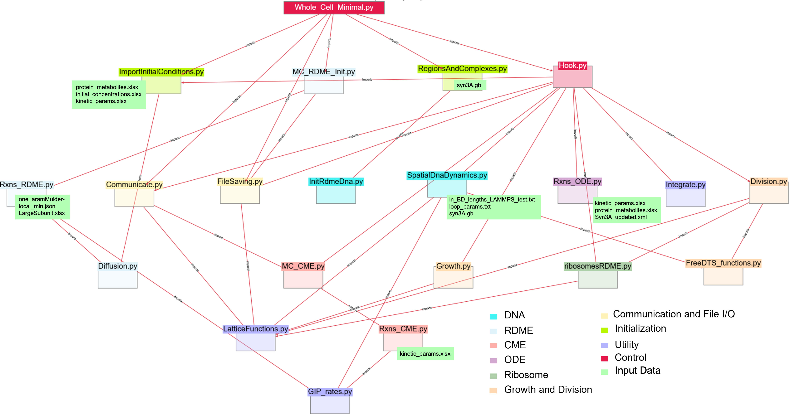

# MC4D

This repository contains the 4D whole-cell model for the genetically minimal cell, JCVI-syn3A. Below, you will find instructions on required programs that need to be installed, instructions on how to run the model, and descriptions of individual simulation files.

## Required Programs

- [Lattice Microbes](https://github.com/Luthey-Schulten-Lab/Lattice_Microbes) - [https://github.com/Luthey-Schulten-Lab/Lattice_Microbes](https://github.com/Luthey-Schulten-Lab/Lattice_Microbes)
- [odecell](https://github.com/Luthey-Schulten-Lab/odecell) - [https://github.com/Luthey-Schulten-Lab/odecell](https://github.com/Luthey-Schulten-Lab/odecell) (Install this in the same conda environment as Lattice Microbes AFTER building Lattice Microbes)
- [btree_chromo](https://github.com/Luthey-Schulten-Lab/btree_chromo_gpu) - [https://github.com/Luthey-Schulten-Lab/btree_chromo_gpu](https://github.com/Luthey-Schulten-Lab/btree_chromo_gpu) (Requires installation with Kokkos enabled version of LAMMPS)
- [sc_chain_generation](https://github.com/Luthey-Schulten-Lab/sc_chain_generation) - [https://github.com/Luthey-Schulten-Lab/sc_chain_generation](https://github.com/Luthey-Schulten-Lab/sc_chain_generation)
- [FreeDTS](https://github.com/weria-pezeshkian/FreeDTS) - [https://github.com/weria-pezeshkian/FreeDTS](https://github.com/weria-pezeshkian/FreeDTS) (OPTIONAL)

## Running the Model

The model here is runnbale as-is and does not reuire its own installation. Once you have installed the required programs listed above, before running the model, you must activate the conda environment in which you built Lattice Microbes:

```
conda activate envName
```

Then, you must make sure that your LAMMPS installation for ```btree_chromo``` is in your path. You can check this by running:

```
lammps -h
```

Once your environment is ready, you can now run the model.

The python file ```Whole_Cell_Minimal_Cell.py``` is the main executable for the model. The executable has the following user input variables:

|  Variable  | Shorthand | Description |
|------------|-----------|-------------|
| --outputDir | -od | Name of directory that will be created to store trajectory files. DO NOT INCLUDE A '.' |
| --simTime | -t | Amount of biological time to be simulated in units of seconds. |
| --cudeDevices | -cd | Integer index of the GPU to use for the Lattice Microbes RDME solver. |
| --dnaSoftwareDirectory | -dsd | Directory containing the ```btree_chromo/``` and ```sc_chain_generation/``` directories. |
| --dnaRngSeed | -drs | Integer RNG seed that will be used for the chromosome programs. |
| --workingDirectory | -wd | Directory where the simulation is being run in. Defaults to current directory, no input is needed. Only necessary to change on clusters. |

Example executable:

```
python Whole_Cell_Minimal_Cell.py -od replicate1 -t 1200 -cd 1 -drs 13 -dsd /home/zane/Software/
```

## Restarting a simulation

If you want to run more time for a simulation or you need to restart a simulations because of a crash, you can run the available restart python script ```Restart_Whole_Cell_Minimal_Cell.py```

This python executable has the same input variables as the original script. This will only run if ```outputDir``` is a directory that contains all associated files with a previously run simulation from the main script. For example, if you provided the input ```-od replicate1``` previously, giving that same argument to the restart script will take the simulation state from the replicate1 directory.

The ```simTime``` variable is how much more biological time you want to run. If you have simulated 3600 seconds and want to reach a total of 6000 seconds, you would give an input of 2400 for this variable.

## Descriptions of Simulation Files

| File Name | Description |
|-----------|-------------|
|```input_data/``` | Directory containing initial conditions, kinetic parameters, and other data used to initialize the whole-cell model. |
| ``` Communicate.py ``` | Procedures used to communicate counts of molecules between different methodologies. For example, extraction of enzyme counts from RDME to use in rates of ODE reactions. |
| ``` Diffusion.py ``` | Sets the diffudion rules for all molecules that are put into the RDME lattice. |
| ``` Division.py ``` | Updates cell morphology and particle positions on the RDME lattice during cell division. |
| ``` FileSaving.py ``` | Records the cell state and generates restart files. |
| ```FreeDTS_functions.py``` | Defines set of functions used to interpret output files of membrane shapes from FreeDTS. |
| ``` GIP_rates.py ``` | Contains functions for rate equations of genetic information processing reactions. |
| ``` Growth.py  ``` | Updates cell morphology and particle positions on the RDME lattice as the cell grows spherically. |
| ``` Hook.py ``` | IMPORTANT Defines main algorithm used when interrupting the RDME solver. Includes executing all other simulations methods and calling functions to communicate betwwen the methods. |
| ``` ImportInitialConditions.py ``` | Loads initial condition data into initialize the system. |
| ``` InitRdmeDNA.py ``` | Creates an initial condition chromosome configuration using ```sc_chain_generation``` and communicates the structure to the RDME lattice. |
| ``` Integrate.py ``` | Runs the ODE integrator for metabolism. |
| ``` LatticeFunctions.py ``` | Defines functions used in communication to manipulate the RDME lattice. |
| ``` MC_CME.py ``` | Creates and runs the global CME simulation for tRNA charging and transcription. |
| ``` MC_RDME_initialization.py ``` | Initializes RDME simulation including site types and reactions. |
| ``` RegionsAndComplexes.py ``` | Initializes shapes of cell regions (e.g. membrane and cytoplasm) onto the RDME lattice. |
| ```Restart_Hook.py``` | Modified version of ```Hook.py``` that is used for simulations that have been restarted. |
| ```Restart_MC_RDME_initialization.py``` | Constructs a whole-cell simulation from the last recorded cell state of a preexisting simulation. |
| ```Restart_Whole_Cell_Minimal_Cell.py``` | Executable for restarting simulations. |
| ``` RibosomesRDME.py ``` | Updates excluded volume of ribosomes so that the ribosomes lattice sites follow the center of mass particle. |
| ``` Run_CME.py ``` | Executable file for global CME. |
| ``` Rxns_CME.py ``` | Defines set of reactions simulated in the global CME. |
| ``` Rxns_ODE.py ``` | Defines set of reactions simulated using deterministic ODEs. |
| ``` Rxns_RDME.py ``` | Defines set of reactions simulated on the RDME lattice. |
| ``` SpatialDnaDynamics.py ``` | Procedures for running ```btree_chromo``` and updating the chromosome state on the RDME lattice. |

## Simulation Files and Input Data by Model Component

| Model Component | Simulation Files | Input Data |
|---------------|-------------|-------------|
|RDME - Reaction-Diffusion Master Equaion| ``` MC_RDME_initialization.py ```, ``` Rxns_RDME.py ```, ``` Diffusion.py ```, ```RegionsAndComplexes.py```, ```RibosomesRDME.py```, ```InitRdmeDna.py``` | ``` oneParamMulder-local_min.json ```, ``` LargeSubunit.xlsx ```|
|CME - Chemical Master Equation|``` MC_CME.py ```, ``` Run_CME.py ```, ``` Rxns_CME.py ``` | ``` kinetic_params.xlsx ```|
|ODE - Ordinary Differential Equations| ``` Rxns_ODE.py ```, ```integrate.py```| ``` kinetic_params.xlsx ```, ``` protein_metabolites.xlsx ```, ``` Syn3A_updated.xml ```|
|BD (DNA) - Brownian Dynamics of DNA| ``` InitRdmeDNA.py ```, ``` SpatialDnaDynamics.py ```| ``` in_BD_lengths_LAMMPS_test.txt ```, ``` loop_params.txt ```, ``` syn3A.gb ```|



